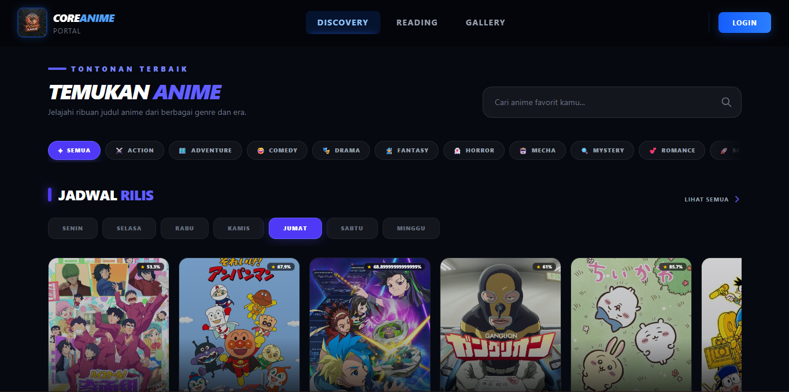
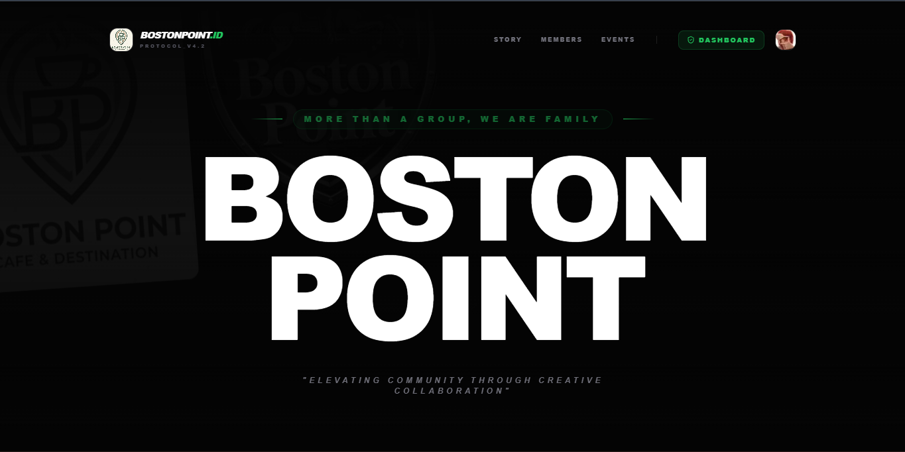

  

<h1 align="center">Welcome to Core Dev Group 🚀</h1>

  <strong>Membangun ekosistem developer yang solid, interaktif, dan terus berkembang melalui solusi modular.</strong>

  

---

## 🌟 Tentang Kami

**Core Dev Group** adalah pusat kolaborasi bagi para *programmer*, *developer*, dan antusias teknologi. Kami berfokus pada pengembangan infrastruktur komunitas modern, platform web modular, dan alat bantu produktivitas. Kami percaya bahwa kode yang baik lahir dari komunitas yang saling mendukung.

---

## 📊 Ecosystem Status

  
  
  

---

## 🚀 Proyek Ekosistem Kami

Kami mengelola tiga pilar utama proyek yang saling terintegrasi untuk mendukung komunitas:

### 1. 🤖 Core Dev Infrastructure (Discord Bot)

Sistem otomasi dan manajemen komunitas yang dirancang khusus untuk mendukung interaksi para developer.

🔗 https://github.com/core-dev-group/core-anime-bot

- **Fitur Utama:** Advanced Leveling System (Canvacord v6), Developer Utilities (NPM, GitHub, MDN), dan Custom Profile Database.
- **Tech Stack:** Node.js, Discord.js v14, MongoDB.

### 2. ⛩️ Core Anime Modular (Web Portal)

Platform eksplorasi kultur pop Jepang yang cepat, responsif, dan modular bagi pecinta anime dan manga.

🔗 https://github.com/core-dev-group/core-anime-modular

- **Fitur Utama:** Katalog Anime/Manga, Jadwal Rilis (Airing), Galeri Waifu, dan Anime Quotes API.
- **Tech Stack:** Next.js 15, TypeScript, Tailwind CSS, Jikan API.

### 3. 🏢 Boston Point System (Community Management)

Platform manajemen internal terpadu untuk pengelolaan operasional komunitas secara efisien.

🔗 https://github.com/core-dev-group/boston-point

- **Fitur Utama:** Member Management, Event Organizer, Gallery Moments, dan Admin/Developer Metrics Dashboard.
- **Tech Stack:** Next.js 15, TypeScript, MongoDB, NextAuth.js.

---

## 👀 Preview

### 🎬 Core Anime Modular

  

### 🏢 Boston Point System

  

### 🤖 Core Dev Bot

  

---

## 🛠️ Global Tech Stack

Infrastruktur kami dibangun dengan teknologi modern yang tangguh dan fleksibel:

  
  
  
  
  
  

---

## 👨‍💻 Founder & Architect

Seluruh ekosistem ini diinisiasi dan dikembangkan oleh:

- **kodel-dev** - *Full-stack Developer & Architect*

  <i>"Menulis kode bukan hanya tentang mesin yang memahaminya, tapi tentang membangun karya yang bermanfaat untuk ekosistem."</i>
    
  
  

  

