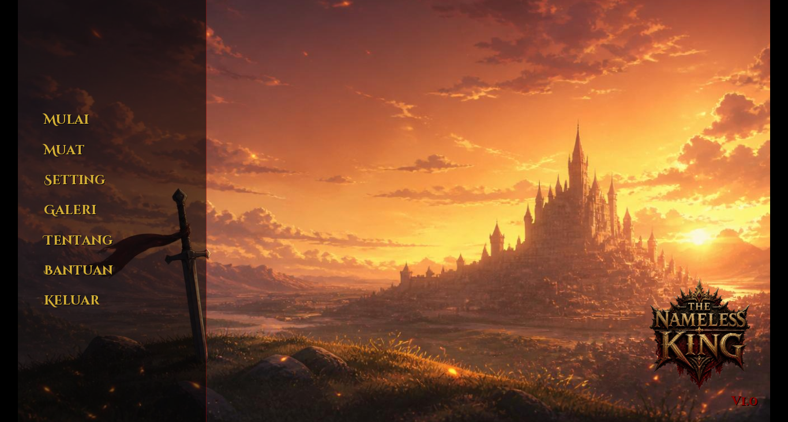
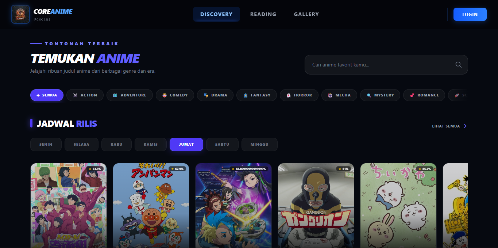
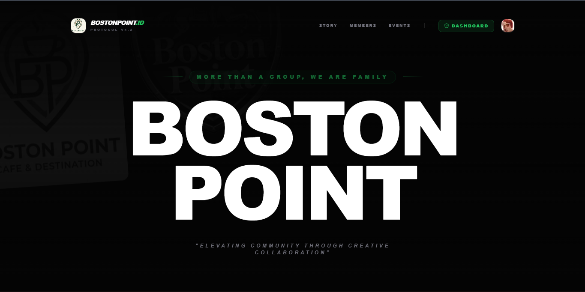

  

<h1 align="center">Welcome to Core Dev Group 🚀</h1>

  <strong>Membangun ekosistem developer yang solid, interaktif, dan terus berkembang melalui solusi modular.</strong>

---

## 🌟 Tentang Kami

**Core Dev Group** adalah pusat kolaborasi bagi para *programmer*, *developer*, dan antusias teknologi. Kami berfokus pada pengembangan infrastruktur komunitas modern, platform web modular, alat bantu produktivitas, hingga narasi visual interaktif. Kami percaya bahwa kode yang baik lahir dari komunitas yang saling mendukung.

---

## 🎯 Visi & Misi

### 👁️ Visi
> *"Menjadi pusat kolaborasi developer dan inkubator teknologi modular terdepan yang memadukan inovasi kode, kreativitas visual, serta solidaritas komunitas yang berkelanjutan."*

### 🚀 Misi
1. **Membangun Infrastruktur & Ekosistem Modular** — Mengembangkan alat bantu produktivitas, sistem otomatisasi, dan platform web terintegrasi yang andal.
2. **Menghadirkan Solusi Kreatif & Interaktif** — Menggabungkan teknologi modern dengan karya kreatif seperti platform digital dan pengembangan game (*Visual Novel*).
3. **Mendorong Pertumbuhan Kolaboratif** — Menciptakan lingkungan yang inklusif bagi para *programmer* dan antusias teknologi untuk saling berbagi ilmu.
4. **Menjunjung Tinggi Standar Kualitas** — Memanfaatkan *tech stack* modern untuk menghasilkan produk digital yang bersih, efisien, dan fungsional.

---

## 📊 Ecosystem Status

  
  
  
  
  

---

## 🚀 Proyek Ekosistem Kami

Kami mengelola berbagai pilar utama proyek yang saling terintegrasi untuk mendukung komunitas dan karya kami:

### 1. 🤖 Core Dev Infrastructure (Discord Bot)

Sistem otomasi dan manajemen komunitas yang dirancang khusus untuk mendukung interaksi para developer.

- **Fitur Utama:** Advanced Leveling System (Canvacord v6), Developer Utilities (NPM, GitHub, MDN), dan Custom Profile Database.
- **Tech Stack:** Node.js, Discord.js v14, MongoDB.

### 2. 👑 The Nameless King (Visual Novel Project)

Proyek pengembangan game *Visual Novel* bergenre *dark fantasy* bertajuk **"The Nameless King"**, mengisahkan intrik takhta, pengembara, dan rahasia yang terkubur.

- **Fitur Utama:** Branching Narrative (Pilihan Cerita), Karakter Dinamis, dan Ilustrasi Suasana Kerajaan.
- **Tech Stack:** Ren'Py, Python, Custom Asset Management.

> # 👑 THE NAMELESS KING — OFFICIAL PORTAL 👑
> *"Di atas tanah yang terlupakan, sebuah takhta menanti rajanya yang sejati..."*
>
> Halo, para pengembara! Kunjungi portal web resmi kami untuk menjelajahi dunia **"The Nameless King"** secara lengkap.
>
> **Apa yang bisa kamu temukan di website?**
> 🔮 Sinopsis lengkap perjalanan Alexios dan relik Besi Bintang
> ✨ Ensiklopedia dunia dan pengenalan karakter utama
> 🎶 Pemutar audio BGM eksklusif dengan visualizer dinamis
> 📥 Informasi akses Open Beta dan log pembaruan terkini
>
> ⚔️ **Ambil pedangmu, dan kunjungi website resminya sekarang:**
>   
> <a href="https://the-nameless-king.vercel.app/">
>   
> </a>

### 3. ⛩️ Core Anime Modular (Web Portal)

Platform eksplorasi kultur pop Jepang yang cepat, responsif, dan modular bagi pecinta anime dan manga.

- **Fitur Utama:** Katalog Anime/Manga, Jadwal Rilis (Airing), Galeri Waifu, dan Anime Quotes API.
- **Tech Stack:** Next.js 15, TypeScript, Tailwind CSS, Jikan API.

### 4. 🏢 Boston Point System (Community Management)

Platform manajemen internal terpadu untuk pengelolaan operasional komunitas secara efisien.

- **Fitur Utama:** Member Management, Event Organizer, Gallery Moments, dan Admin/Developer Metrics Dashboard.
- **Tech Stack:** Next.js 15, TypeScript, MongoDB, NextAuth.js.

### 5. 💳 Makima Finance (Personal Finance App)

Aplikasi pengatur keuangan pribadi bergaya *Dark Crimson* dengan AI Advisor & Vision Scanner.

- **Fitur Utama:** Makima AI Advisor (Llama 3.3 70B), OCR Receipt Scanner, pencatat hutang-piutang, split bill, dan ekspor kalender .ics lokal.
- **Tech Stack:** Flutter, Dart, Hive NoSQL.

---

## 👀 Preview

### 👑 The Nameless King

  

### ⛩️ Core Anime Modular

  

### 🏢 Boston Point System

  

### 💳 Makima Finance

  

### 🤖 Core Dev Bot

  

---

## 🛠️ Global Tech Stack

Infrastruktur dan karya kami dibangun dengan teknologi modern yang tangguh dan fleksibel:

  
  
  
  
  
  
  
  
  

---

## 👨💻 Founder & Architect

Seluruh ekosistem ini diinisiasi dan dikembangkan oleh:

- **kodel-dev** - *Full-stack Developer & Architect*

  <i>"Menulis kode bukan hanya tentang mesin yang memahaminya, tapi tentang membangun karya yang bermanfaat untuk ekosistem."</i>
    
  
  

  

